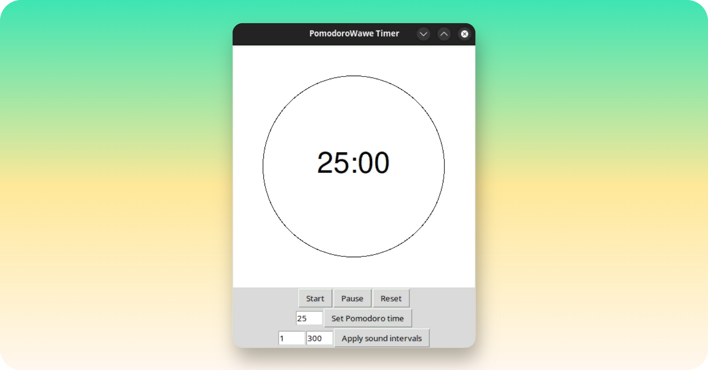

## 1. General info
The project "PomoWave" is a Pomodoro timer implementation written in Python.\
I use this Pomodoro timer for work.

This timer is created to incorporate two distinctive features:
1. Quick startup:\
Many Pomodoro timers take a long time to start up due to dependencies.\
However, this timer is designed to launch quickly.
2. Time ticking sound:\
The ticking sound of a clock helps me stay focused and keep track of time,\
especially when I get distracted.

The timer looks like below:
<p align="center">
    
</p>

## 2. Downloading the Repository
To download the repository, you have a few options

### 2.1. Clone the Repository via git
If you have Git installed on your system, you can clone the repository using\
the following command in your terminal or command prompt:
```bash
  # Clone repo via SSH
$ REPO_URL='git@github.com:linxuil/pomow.git'&&\
GOAL_DIR_NAME='pomow'&&\
git clone "${REPO_URL}" "${GOAL_DIR_NAME}"
```
This will create a local copy of the repository on your machine.

### 2.2. Download as ZIP file
Alternatively, you can download the repository as a ZIP file.\
Simply navigate to the repository's page here and click on the "Code" button.\
Then select "Download ZIP" to save the ZIP file to your computer.\
After downloading, extract the contents of the ZIP file to access the repository files.


## 3. Requirements
Installation or verification of two packages is required:
- Tkinter for the GUI
- Simpleaudio for audio playback. Documentation for Simpleaudio installation:
https://simpleaudio.readthedocs.io/en/latest/installation.html


### 3.1. Ubuntu
Tested on Ubuntu 23.10:
```bash
$ sudo apt-get install python3-tk

$ sudo apt-get install python3-pip
$ pip install --upgrade pip setuptools --break-system-packages
$ sudo apt-get install -y python3-dev libasound2-dev
$ pip install simpleaudio --break-system-packages
```

### 3.2. Windows
To install Simpleaudio, you must first install the C++ Build Tools from the following link:
https://visualstudio.microsoft.com/ru/visual-cpp-build-tools/

After downloading the "Visual Studio Installer" `vs_BuildTools.exe`.\
Open "Visual Studio Installer" and select only the C/C++ checkbox.

After htis you can install simpleaudio without errors:

```powershell
> pip install simpleaudio
```

## 4. Usage
### 4.1. Without install module
Try use python script via cmd without install:
```bash
$ cd pomow
$ ./pomow
```
### 4.2. PIP module istall
You can install via `pip` in venv:
```bash
$ cd pomow

# Install venv if needed
$ sudo apt install python3-venv

# Create and activate venv in directory "venv"
$ VENV_DIR_NAME='venv'&&\
python3 -m venv "${VENV_DIR_NAME}"&&\
source venv/bin/activate

# Install module and check it
$ pip install -e .
$ pip list | grep pomow

# Try use console command
$ pomow
```
Then you need exit from venv
```bash
$ deactivate
```
Uninstall packet via `pip` in venv:
```bash
$ pip uninstall pomow
```

## 5. Create *.EXE file for Windows
You can create an EXE file on Windows using PyInstaller by following these steps:

- Add the following code at the end of the `pomow.py` file:
```python

if __name__ == "__main__":
    main()
```

- Build the EXE file using the following PowerShell commands:
```powershell
> cd <!pomow_src_root_dir!>

> python -m PyInstaller --onefile --windowed --debug=all --add-data="src/*:src" pomow.py
```
Afterwards, navigate to the `<!pomow_src_root_dir!>/dist` directory to find the newly created `pomow.exe`

<!-- CONTRIBUTING -->
## 6. Contributing

If you have a suggestion that would make this better,\
please fork the repo and create a pull request.\
You can also simply open an issue with the tag "enhancement".\
Don't forget to give the project a star! Thanks again!

1. Fork the Project
2. Create your Feature Branch (`git checkout -b feature/YouFeature`)
3. Write any changes in code
4. Add changes to index (`git add -A`)
5. Commit your Changes (`git commit -m 'You description'`)
6. Push to the Branch (`git push origin feature/YouFeature`)
7. Open a Pull Request on github

## 7. License

Distributed under the MIT License. See `LICENSE.md` for more information.

## 8. Contact

voiduin - voiduin@gmail.com

Project Link: [https://github.com/voiduin/pomow](https://github.com/voiduin/pomow)
